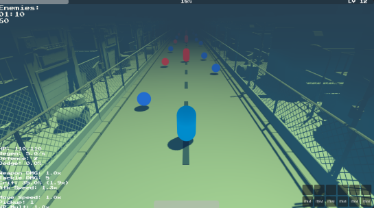
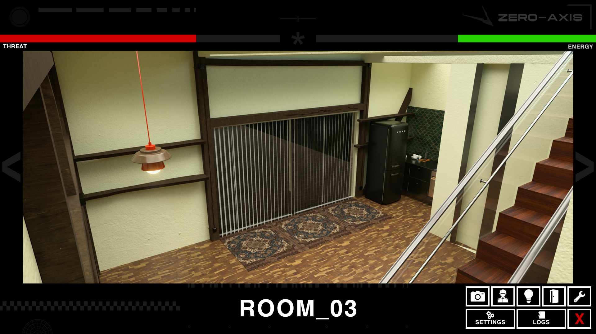
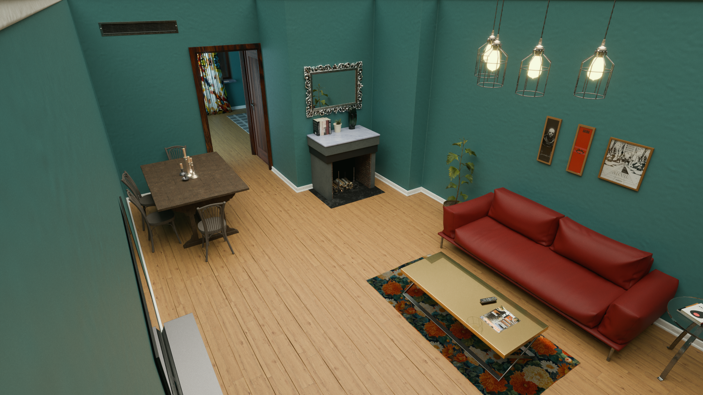
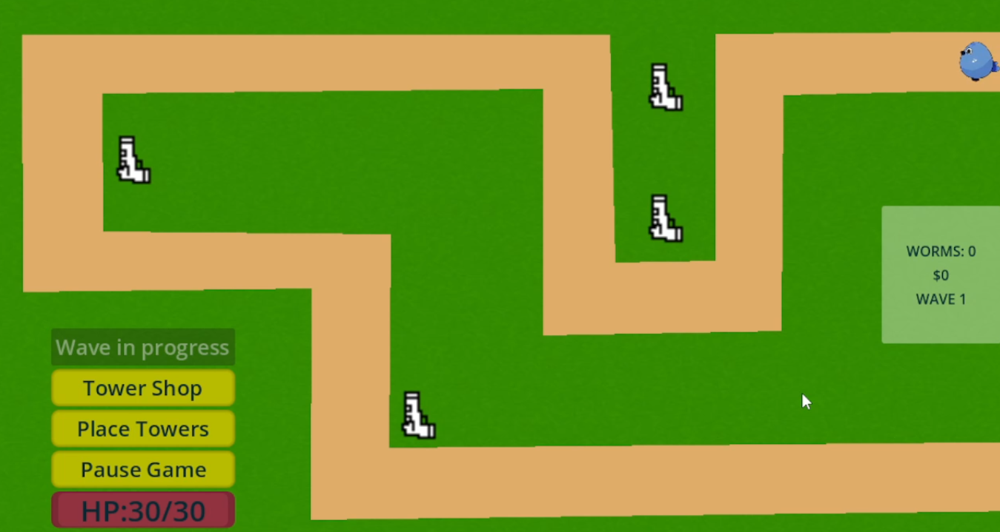
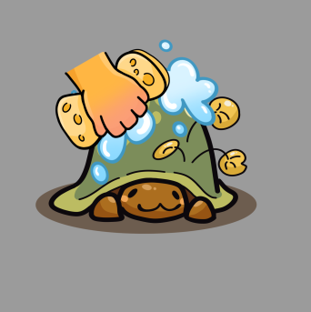
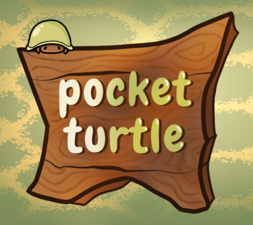
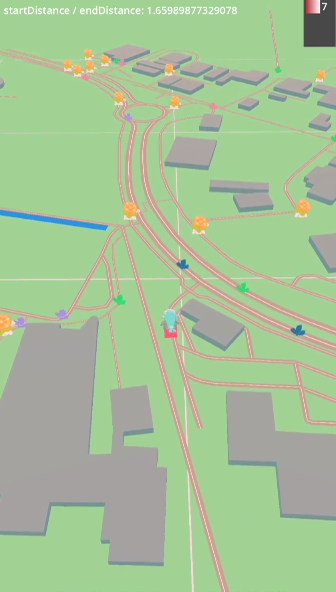

# Games-In-Progress
*We're looking for additional coders for following games:*

---

## **Discordant Noise**

**Rhythm-based top-down action RPG boss rush**

* **Game Design Document:** [Game Design Document](./discordant_noise/discordant_noise_revised_gdd.pdf)
* **Source Code:** [https://github.com/100-Devs-1-Game/DiscordantNoise](https://github.com/100-Devs-1-Game/DiscordantNoise)

---

## **Escape For Help**

**Endless auto-shooter with meta-progression**

* **Images:** 
* **Design Notes (MD):** [Roadmap](./escape_for_help/escape_for_help.md)
* **Source Code:** [https://github.com/100-Devs-1-Game/EscapeForHelp](https://github.com/100-Devs-1-Game/EscapeForHelp)

---

## **Intrusion**

**FNAF-style horror experience**

* **Images:**   
* **Source Code:** [https://github.com/100-Devs-1-Game/INTRUSION](https://github.com/100-Devs-1-Game/INTRUSION)

---

## **Mossy March Defense**

**Stylized Tower Defense**

* **Game Design Document:** [Game Design Document](./mossy_march_defense/mossy_march_defense_gdd.pdf)
* **Images:** 
* **Source Code:** [https://github.com/100-Devs-1-Game/MossyMarchDefense](https://github.com/100-Devs-1-Game/MossyMarchDefense)

---

## **Pocket Turtle**

**Virtual pet / Tamagotchi-style game**

* **Images:**  

---

## **Spiritwalker**

**Mobile AR adventure inspired by Pokémon GO**

* **Game Design Document:** [Game Design Document](./spiritwalker/spiritwalker_gdd.pdf)
* **Images:** 

